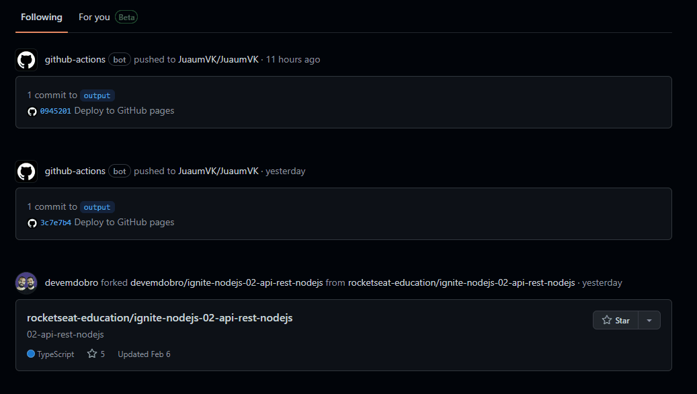

# Projeto com README
Um projeto de teste com um arquivo README 👍😁

[]

## Tegnologias ultilzadas
- HTML
- CSS
- JS 

## Como ultilizar

1 - Clone pro o projeto
```
git clone
```
2 - Acesse a pasta do projeto
```
cd repositorio-com-readme
```